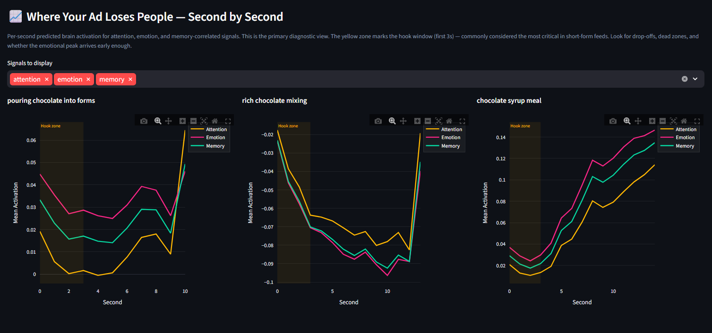
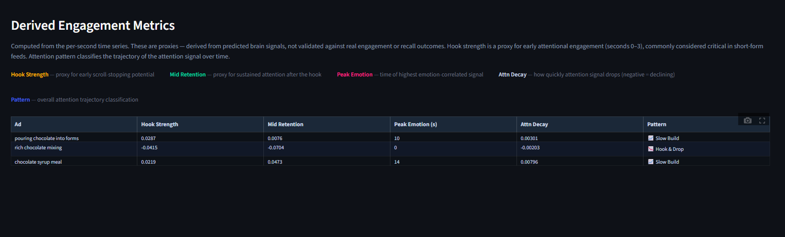
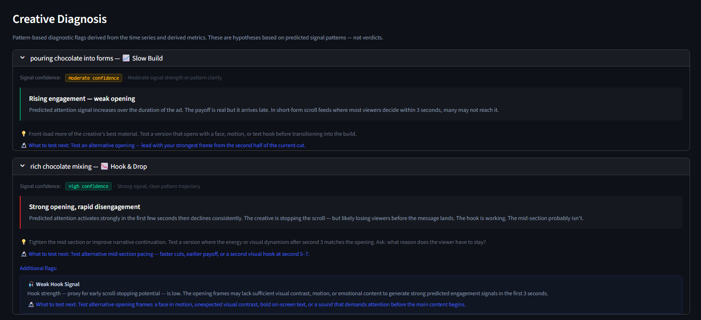
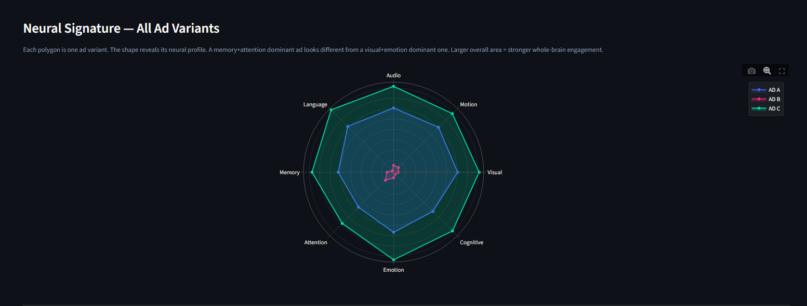
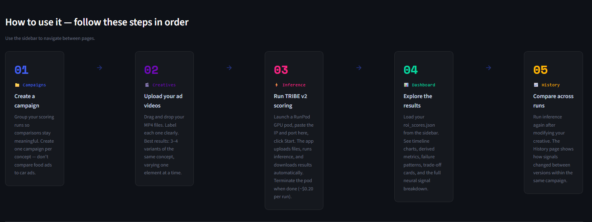

# tribe-adcortex

> Exploring how engagement in video ads evolves over time, instead of relying on a single average score.

This project analyses video ad creatives using time-series signals and surfaces how attention, emotion, and memory-related signals change second by second.

**Built by Tobi** · Python · PostgreSQL · dbt · Streamlit · Docker

---

## What this is

Most ad analysis collapses performance into a single number — CTR, average watch time, a composite score.

This project explores a different angle:

> Two ads can have the same average performance but behave completely differently over time.

- One spikes early and drops
- Another builds slowly and peaks later

The goal is to make those patterns visible and measurable.

---

## Example insight

Three chocolate ad variants scored in a recent run:

- **Pouring chocolate into forms** — attention starts moderate, dips mid-way, recovers late. Slow build pattern. Peak emotion at second 10.
- **Rich chocolate mixing** — below-baseline activation throughout, dramatic spike at the very end. Most viewers in a scroll feed never reach it.
- **Chocolate syrup meal** — all three signals (attention, emotion, memory) build consistently from second 0 to second 15. The only creative that never loses the viewer.

Same product category. Same duration. Completely different engagement trajectories.

This kind of pattern is invisible in aggregate metrics but becomes clear in a time-series view.

---

## Process & Results

**Timeline — where each ad loses people**


**Derived metrics — hook strength, retention, pattern classification**


**Creative diagnosis — failure patterns and what to test next**


**Neural signature — per-ad signal profile**


**Home screen — workflow guide**


---

## What it does

- Processes 3–4 video ad creatives per run
- Generates per-second signals across 8 brain-correlated signal groups
- Derives interpretable metrics:
  - Hook strength (0–3s proxy for early engagement)
  - Mid retention (3–10s sustained attention)
  - Peak emotion timing
  - Attention decay rate and pattern classification
- Classifies engagement patterns: hook-and-drop / slow build / sustained
- Flags potential issues: weak hook, late emotional peak, high motion with low memory signal
- Stores results in PostgreSQL, transforms via dbt, visualises in Streamlit

---

## The time-series idea

The underlying model (TRIBE v2) produces predictions per second across cortical signals.

Instead of averaging everything into a single number, this project keeps the timeline intact. That allows you to see:

- where attention spikes
- where it drops
- how long engagement is sustained
- when emotional peaks occur relative to the hook window

The dashboard's primary view is a second-by-second line chart — not a bar chart of averages.

---

## Derived metrics

| Metric | Description |
|---|---|
| Hook Strength | Proxy for early attentional engagement (seconds 0–3) |
| Mid Retention | Sustained attention signal after the hook (seconds 3–10) |
| Peak Emotion | Second index of highest emotion-correlated signal |
| Attention Decay | Linear slope of attention over time — negative = declining |
| Pattern | hook_and_drop / slow_build / sustained |

---

## Stack

| Layer | Technology |
|---|---|
| Inference | TRIBE v2 · Python 3.12 · GPU (RunPod) |
| Database | PostgreSQL 16 · port 5435 |
| Transform | dbt — staging views + mart tables |
| Dashboard | Streamlit · 5-page app · port 8504 |
| Containers | Docker + docker-compose |

---

## Architecture

```
Video creatives (MP4)
        ↓
TRIBE v2 — GPU inference (RunPod)
        ↓
Per-second signals (n_seconds × 20,484 cortical vertices)
        ↓
ROI group extraction + derived metrics (Python)
        ↓
PostgreSQL — raw_roi_scores · roi_timeseries · derived_metrics
        ↓
dbt — staging → mart (z-scores, rankings, pattern classification)
        ↓
Streamlit dashboard — timeline charts · diagnosis · trade-off cards
```

---

## App pages

| Page | Purpose |
|---|---|
| Campaigns | Create campaigns, group runs for meaningful comparison |
| Creatives | Upload MP4s, label each variant |
| Inference | One-click automated RunPod inference |
| Dashboard | Explore results — timelines, derived metrics, diagnosis |
| History | Compare runs within a campaign |

---

## Running locally

```bash
git clone https://github.com/adheir01/tribe-adcortex
cd tribe-adcortex
cp .env.example .env
# Edit .env: set POSTGRES_PASSWORD and HF_TOKEN
docker-compose up -d
```

Open `http://localhost:8504` and follow the workflow guide on the home screen.

For GPU inference, a RunPod account is needed (~$0.20 per run on an A40).

---

## Notes on interpretation

- Signals represent **predicted neural activation** — not direct measurements of human behaviour
- Useful for **relative comparison within a run**, not across separate experiments
- Best used when testing **variations of the same concept** — same product, one variable changed
- Patterns are classifications of signal trajectories, not guarantees of real-world engagement

---

## Limitations

- Based on model predictions, not real user behaviour or recall data
- TRIBE v2 predicts for an average subject — individual and demographic variation not captured
- Trained on naturalistic film and speech content, not commercial ads specifically
- ROI vertex masks use approximate spatial splits — valid for relative comparison

---

## License note

Uses TRIBE v2 (`facebook/tribev2`) licensed under CC BY-NC 4.0. Non-commercial use only.

---

## Citation

```bibtex
@article{dAscoli2026TribeV2,
  title={A foundation model of vision, audition, and language for in-silico neuroscience},
  author={d'Ascoli, St{\'e}phane and Rapin, J{\'e}r{\'e}my and Benchetrit, Yohann
          and Brookes, Teon and Begany, Katelyn and Raugel, Jos{\'e}phine
          and Banville, Hubert and King, Jean-R{\'e}mi},
  year={2026}
}
```

---

## Related

- [instagram-fake-detector](https://github.com/adheir01/instagram-fake-detector) — Project 01
- Project 02 — Influencer ROI Scorer
- Project 03 — Engagement Anomaly Dashboard
